# Linux Exercise:
> Your login name: altschool i.e., home directory /home/altschool. The home directory contains the following sub-directories: code, tests, personal, misc Unless otherwise specified, you are running commands from the home directory.

---


>i. create login name called Altschool


 >ii. Switch user from Adaeze to Altschool user created

 ```
 sudo su Altschool
 ```

 

 >iii.  create sub directories  named code tests personal misc

 ```
mkdir code tests personal misc
```


 
---

## Instructions
> a.Change directory to the tests directory using absolute pathname

```
cd /home/Altschool/tests
```
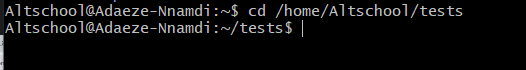

---

>b. Change directory to the tests directory using relative pathname

```
cd ./tests
```


---

>c. Use echo command to create a file named fileA with text content ‘Hello A’ in the misc directory

```
echo 'Hello A' > misc/fileA
```
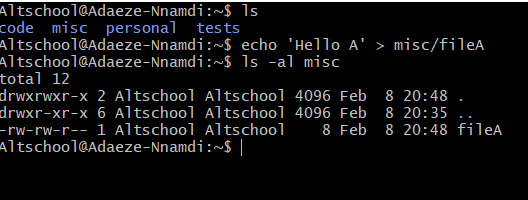

---
>d. Create an empty file named fileB in the misc directory. Populate the file with a dummy content afterwards

```
touch misc/fileB
```

```
nano misc/fileB
```
```
cat misc/fileB
```
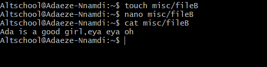

---

>e. Copy contents of fileA into fileC

```
cp misc/fileA misc/fileC
```
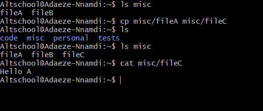

---
>f. Move contents of fileB into fileD

```
mv misc/fileB misc/fileD
```
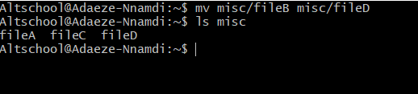

---

>g. Create a tar archive called misc.tar for the contents of misc directory

```
tar -cvf misc.tar misc
```
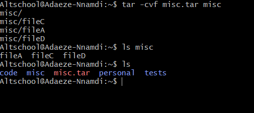

---

>h. Compress the tar archive to create a misc.tar.gz file

```
gzip misc.tar
```
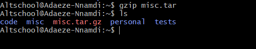

---

>i. Create a user and force the user to change his/her password upon login

```
sudo chage -d 0 praise
```
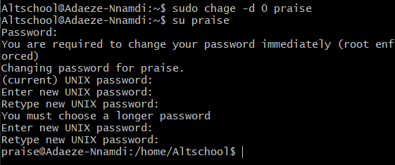

---

>j.Lock a users password

```
sudo passwd -l praise
```
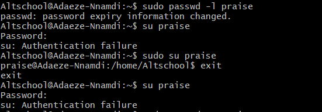

---

>k. Create a user with no login shell 

```
sudo useradd -s /sbin/nologin Vicky
```
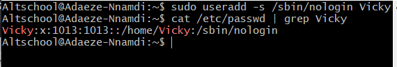

---

>l. Disable password based authentication for ssh

```
 sudo vi /etc/ssh/sshd_config
```


---

>m. Disable root login for ssh

```
vi /etc/ssh/sshd_config
```
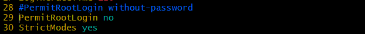